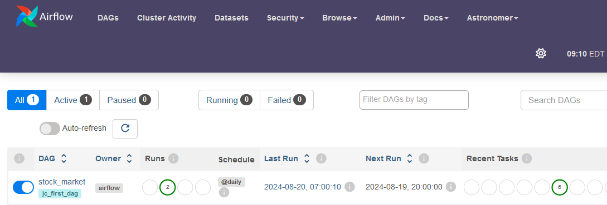
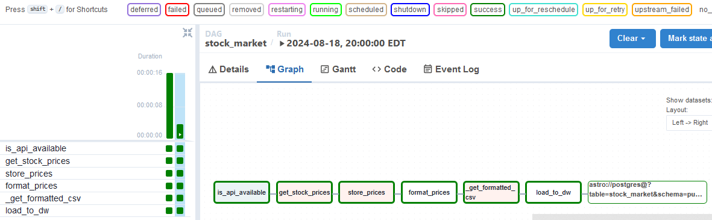
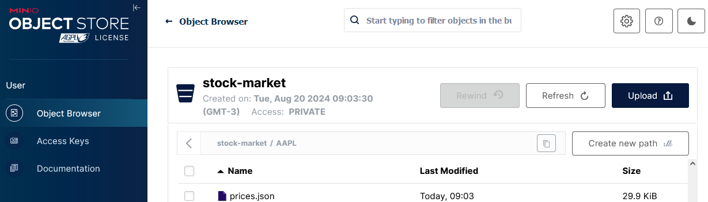

# Airflow - Python - Spark - Minio
## Instruções para execução

Após instalar o astro sdk, acesse a pasta em que o projeto foi clonado e siga os seguintes passos no terminal:

* astro dev init  

* astro dev start  

Assim que o script terminar a execução você poderá checar a interface do Airflow e fazer login.

http://localhost:8080/home

user: admin
password: admin

### connections
Para a coleta dos dados, a aplicação necessita de algumas conexões configuradas no Airflow UI. Acesse Admin -> Connections, e insira as três conexões mencionadas abaixo:

**stocks_yahoo**
connection id: stocks_yahoo
connection type: http
host: https://query1.finance.yahoo.com/

extra: {
"endpoint":"/v8/finance/chart/",  
"headers":{
  "Content-Type":"application/json",
  "User-Agent":"Mozilla/5.0"}
}   
**postgres**
connection id: postgres
connection type: postgres
host: postgres
database: postgres_db
login: postgres
password: postgres
port: 5432  

### minio
connection_id: minio
connection_type: AWS Web Services
AWS Access Key ID: minio
AWS Secret Access Key: minio123

extra: {"endpoint_url":"http://host.docker.internal:9000"}  

### Spark
cd spark/notebooks/stock_transform/
docker build . -t airflow/stock-app

### Airflow UI

Após ligar a DAG e executar, espera-se que todas as tasks tenham sucesso. É possível checar acessando o comando DAGS

execuções:

### Minio UI
localhost:9000

MINIO_ROOT_USER: minio
MINIO_ROOT_PASSWORD: minio123

### Debug

docker build spark/master -t airflow-spark-master
docker build spark/worker -t airflow-spark-worker

astro dev bash

airflow tasks test stock_market is_api_available 20240720
airflow tasks test stock_market get_stock_prices 20240720

docker build spark/notebooks/stock_transform -t airflow/stock-app